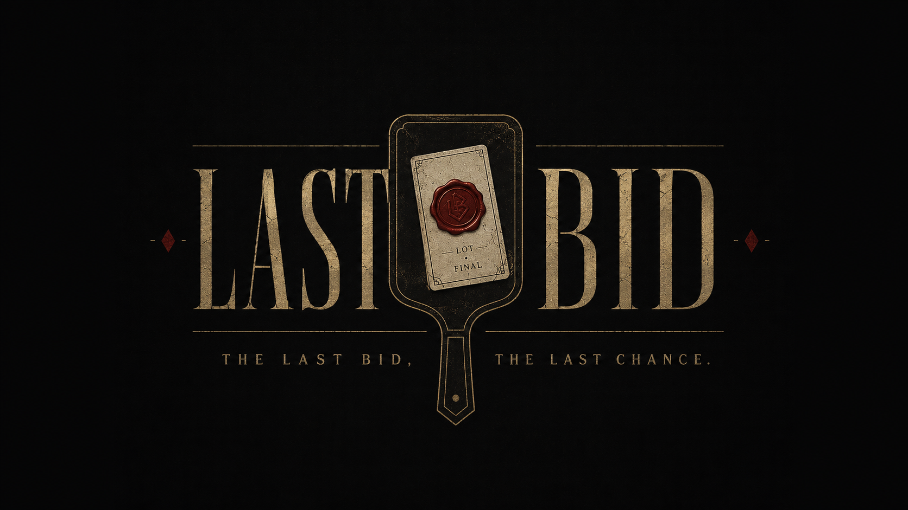
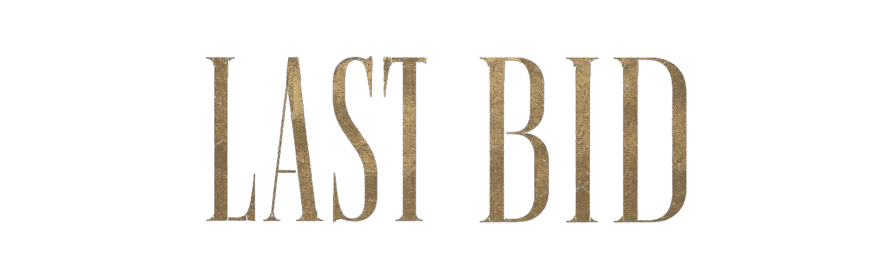

<div align="center">



<br />

[](https://github.com/qtaghdi/last-bid/actions/workflows/ci.yml)

<br />

**불완전한 정보와 상대의 행동을 바탕으로 마지막 입찰을 결정하는 심리 경매 로그라이크**

</div>

---

## LAST BID

**LAST BID**는 위험한 물건들이 거래되는 비밀 경매장을 배경으로 한 싱글 플레이 심리 경매 게임입니다.

플레이어는 경매에 등장한 카드의 정확한 효과를 처음부터 알 수 없습니다.  
제한적으로 공개된 단서와 상대 참가자들의 반응, 입찰 패턴, 성향을 관찰해 카드의 가치와 위험을 추론해야 합니다.

높은 가격에 낙찰받는 것이 항상 좋은 선택은 아닙니다.  
어떤 물건은 당장의 이익을 주지만 이후 더 큰 대가를 요구하고, 어떤 물건은 다른 참가자의 자산이나 생존 상태에 따라 전혀 다른 결과를 만듭니다.

플레이어는 매 라운드 다음을 판단하게 됩니다.

- 이 물건은 어떤 효과를 가진 카드인가
- 상대는 왜 이 카드에 관심을 보이는가
- 지금 가격까지 따라갈 가치가 있는가
- 이번 입찰을 포기하는 것이 더 나은가
- 현재의 이익과 미래의 위험 중 무엇을 선택할 것인가

---

## 핵심 특징

### 불완전한 카드 정보

카드는 처음부터 실제 이름과 정확한 효과를 전부 공개하지 않습니다.

플레이어는 역할군, 위험도, 가치 범위, 발동 시점, 대상 유형과 같은 제한된 단서를 통해 카드의 정체를 추론합니다.

추가 조사를 사용하면 더 많은 정보를 얻을 수 있지만, 사용할 수 있는 정보 자원은 제한되어 있습니다.

### 서로 다른 AI 참가자

플레이어는 각기 다른 성향을 가진 세 명의 AI 참가자와 경쟁합니다.

- **마라 — 겁 많은 생존주의자**
  위험을 피하고 생존에 도움이 되는 카드와 안전한 거래를 선호합니다.

- **세라 — 정보 브로커**
  정보와 계약의 가치를 계산하며 자신만 아는 단서를 거래에 활용합니다.

- **볼트 — 공격적 투기꾼**
  고위험·고수익 카드를 선호하며 도발, 허세 입찰, 공격적인 협상을 시도합니다.

각 참가자는 서로 다른 정보를 가지고 있으며, 자신이 알고 있는 단서와 성향에 따라 카드의 가치를 다르게 평가합니다.

### 위험한 경매

경매에 등장하는 카드들은 단순한 보상 아이템이 아닙니다.

일부 카드는 골드를 제공하지만 일정 시간이 지나면 피해를 주고, 일부 카드는 다음 심판 단계나 다음 경매의 규칙을 바꿉니다.

카드의 가치는 현재 체력, 골드, 보유 카드, 남은 라운드와 상대 참가자의 상태에 따라 계속 달라집니다.

---

## 실행 방법

Godot 4.7 stable에서 프로젝트를 열거나 다음 명령으로 실행합니다.

```bash
godot --path .
```

macOS에서 `godot`이 PATH에 없다면:

```bash
/Applications/Godot.app/Contents/MacOS/Godot --path .
```

메인 씬은 `scenes/main.tscn`이며 기본 해상도는 1280×720입니다.

---

## 현재 개발 상태

현재 안정 기준선은 **Milestone 4 NPC 협상·개성·감정·행동 신호 구현 완료** 상태입니다.

### Milestone 1 완료

기본적인 게임 진행 구조와 카드 효과 시스템이 구현되었습니다.

- 플레이어 1명과 AI 참가자 3명
- 총 10라운드 진행
- 오름 입찰 방식의 경매
- 입찰 및 패스
- 낙찰자 결정
- 체력과 골드
- 카드 획득 및 보유
- 즉시 효과와 지연 효과
- 심판 단계
- 참가자 사망 처리
- 승리 및 패배 판정
- 고정 난수 시드
- 같은 시드에서 같은 결과 재현
- 디버그 로그
- 기본 카드 6종

### Milestone 2 구현 완료

LAST BID의 핵심인 정보 비대칭과 NPC 성향을 검증할 수 있는 규칙 계층을 구현했습니다.

- 실제 카드 정보와 공개 단서 분리
- 플레이어와 NPC별 지식 상태
- 정보 토큰과 추가 조사
- 수집가, 채권자, 도박사의 고유 평가 방식
- NPC 성향에 따른 입찰 행동
- NPC 반응 대사
- 도박사의 제한적인 허세 입찰
- 같은 시드에서 정보 배분과 AI 행동 재현

구현 구조:

- `CardDefinition`: 실제 이름·위험/가치·효과와 공개/숨김 단서 분리
- `CardClueDefinition`: 단서 텍스트, 관련 태그, 주관적 보상/위험 추정치
- `KnowledgeState`: 참가자별 알려진 단서, 믿음, 신뢰도, 공개 수준
- `InformationService`: 기본 단서 배분과 정보 토큰 조사
- `SimpleNpcAi`: 자신이 아는 단서만 사용하는 아키타입 평가와 최대 입찰가
- `NpcDialogueService`: 같은 시드에서 재현되는 상황별 대사
- DEBUG Drawer: 실제 카드, 모든 단서, 참가자 지식, NPC 평가와 허세 상태

### Milestone 2.5 UX Prototype 구현 완료

최종 아트 전에 전체 플레이 흐름과 정보 위계를 검증할 수 있는 Control/Container 기반 와이어프레임을 구현했습니다.

- 공통 HUD: 라운드, 사용자용 단계명, Seed, 정보 토큰, DEBUG 토글
- 참가자 패널: HP, 골드, 공개 보유 카드, 생존/패스/최고 입찰자/현재 차례, NPC 최근 대사
- PRE_INFO: 공개 출품명과 플레이어가 아는 구조화 단서, 추가 조사 결과 강조, NPC 첫 반응
- AUCTION: 시작가, 현재가, 다음 입찰가, 최고 입찰자, 현재 차례, 최소 인상폭, 행동 불가 안내
- POST_AUCTION: 낙찰 결과와 Milestone 3의 개봉/보관/판매/소각 자리
- JUDGMENT / ROUND_END: 실제 발동 카드, 대상, HP·골드 변화, 사망·소모와 생존자 요약
- RUN_RESULT: 최종 상태와 같은 Seed/새 Seed 재시작
- DEBUG Drawer: 실제 카드 정보, 모든 단서, 참가자별 지식, NPC 평가·최대 입찰·허세, RNG Seed와 로그
- 공통 `wireframe_theme.tres`와 `UiPalette`로 어두운 회색·금색·적색·아이보리 팔레트 관리

UI는 액션을 `GameFlowController`에 전달하고 상태와 이벤트만 읽습니다. 단계 전환 권한과 게임 규칙, 결정론적 RNG 순서는 기존 컨트롤러와 시스템에 유지됩니다.

주요 UI 서브씬:

```text
scenes/ui/
  top_hud.tscn
  participant_panel.tscn
  card_info_panel.tscn
  reaction_panel.tscn
  auction_panel.tscn
  post_auction_panel.tscn
  judgment_panel.tscn
  result_panel.tscn
  debug_drawer.tscn
```

### Milestone 3 구현 완료

낙찰 카드는 자동으로 완전 공개되지 않으며, 낙찰 후 별도의 위험 관리와 소유권 판단을 거칩니다.

- 봉인 3단계와 실제 위험도 기반 사고 확률
- 중앙 Seed RNG를 통한 사고 결과 재현
- 부분 개봉 후 봉인 상태 그대로 보관
- 세 번째 봉인 개봉 시 실제 이름·수치·조건 공개와 `ON_OPEN` 실행
- 봉인 카드 3장 인벤토리 제한
- NPC 한 명에게 단서와 가격을 포함한 1회 판매 제안
- 판매 수락 시 골드·소유권·지연 카운트 이전
- 카드별 소각 비용과 데이터 기반 `burn_effect`
- `FOLLOW_CURRENT_OWNER`, `STAY_WITH_ORIGINAL_OWNER`, `CANCEL_ON_TRANSFER`, `TRIGGER_ON_TRANSFER` 정책
- 수집가·채권자·도박사의 결정론적 낙찰 후 `OPEN`·`KEEP`·`BURN` 선택
- 사고·개봉·판매·이전·소각 결과의 POST_AUCTION 및 JUDGMENT 표시

카드별 핵심 정책:

- 저주받은 금고·검은 장부·황금 교수대는 봉인 상태에서도 기존 보유 효과가 작동합니다.
- 깨진 성배는 완전 개봉 후에만 치명 피해 방어가 활성화됩니다.
- 피의 대출은 개봉 시 +500 G를 받고, 카드를 이전하거나 소각해도 최초 개봉자가 상환합니다.
- 가격 폭주는 개봉해야 다음 라운드 최소 인상액을 변경하며 이전할 수 없습니다.

### Milestone 4 구현 완료

PRE_INFO와 AUCTION 사이에 NPC가 먼저 조건을 제안하는 협상 단계를 추가했습니다.

- `PRE_INFO → NEGOTIATION → AUCTION` 단계 흐름
- 라운드당 살아 있는 NPC 최대 2명의 순차 제안
- 카드 구매, 개봉 금지, 정보 교환, 입찰 포기, 카드 보관 요청
- 수락·거절·제안당 한 번의 가격 재제안
- 마라·볼트·세라의 데이터 기반 캐릭터 프로필과 대사
- 런마다 선택되는 캐릭터별 숨겨진 목표와 진행도
- `CALM`, `INTERESTED`, `NERVOUS`, `ANGRY`, `AFRAID`, `SMUG` 감정 상태
- 신뢰도 100% 미만의 캐릭터별 행동 신호(Tell)
- 런 안에서만 유지되는 관계 점수 `-2 ~ +2`
- 마라의 긴급 소각, 볼트의 생명 담보, 세라의 정보 절취
- gameplay RNG와 분리된 결정론적 negotiation RNG·dialogue RNG
- 일반 UI의 감정·관계·Tell·비장의 수단과 DEBUG 전용 목표·수락 기준·RNG 정보

협상 AI는 `KnowledgeState`와 공개 인스턴스 상태만 사용합니다. 실제 카드 효과와 숨겨진 수치를 직접 읽지 않습니다.

### 검증

자동 검증:

```bash
godot --headless --path . -s res://tests/test_runner.gd
```

Milestone 1~3 회귀 테스트와 함께 NEGOTIATION 단계, 제안 생성·응답·재제안, 관계·감정·Tell, 숨겨진 목표, 비장의 수단, RNG 분리, 20 Seed 자동 런을 포함해 `508 assertions`를 검증합니다.

### 지속적 통합

GitHub Actions의 `Godot 4.7 regression` 체크는 `main` 대상 PR, `main` push, 수동 실행에서 동작합니다.

- 공식 Godot `4.7-stable` Linux 바이너리를 고정 SHA-256으로 검증한 뒤 사용
- 변경 범위의 공백 오류 검사
- 에디터 헤드리스 import로 씬과 리소스 로드 확인
- 회귀 테스트를 서로 독립된 프로세스에서 2회 실행해 결정론 재확인
- 같은 PR의 이전 실행은 취소해 불필요한 Actions 사용 시간 절약
- 저장소 쓰기나 비밀값 없이 `contents: read` 권한만 사용

워크플로 정의는 `.github/workflows/ci.yml`에 있습니다. `main` 보호 규칙에서는 `Godot 4.7 regression`을 필수 체크로 지정하는 것을 권장합니다.

수동 UX 검증 절차:

1. 프로젝트를 실행하고 1280×720에서 PRE_INFO의 참가자·카드·NPC 반응·하단 액션이 한 화면에 들어오는지 확인합니다.
2. `추가 조사` 후 금색 `◆ 새 조사 단서`가 카드 패널에 나타나고 INFO가 감소하는지 확인합니다.
3. 협상으로 이동해 NPC 이름·감정·Tell·관계와 제안 조건을 확인합니다.
4. 수락·거절·가격 올리기를 각각 시도하고 한 제안에서 재제안이 한 번만 가능한지 확인합니다.
5. 모든 제안을 처리하기 전에는 경매 시작이 비활성인지 확인합니다.
6. 입찰 포기 또는 정보 교환을 수락했다면 경매 시작 직후 플레이어가 패스 상태인지 확인합니다.
7. 경매에서 `입찰 없음`, `첫 입찰 N G`, 현재 차례와 입찰 불가 안내가 즉시 갱신되는지 확인합니다.
8. 직접 낙찰한 뒤 처리 전에는 `심판으로`가 비활성인지 확인합니다.
9. 봉인을 하나만 열어 사고 확률과 새 정보를 확인하고 보관합니다.
10. 세 번째 봉인까지 열어 실제 카드명·효과와 `ON_OPEN` 결과가 표시되는지 확인합니다.
11. DEBUG에서 숨겨진 목표·제안 점수·수락 기준·Tell reliability·협상 RNG가 일반 UI와 분리되는지 확인합니다.
12. 창을 1920×1080으로 확대해 Anchor/Container 확장, 텍스트 줄바꿈, 패널 잘림 여부를 다시 확인합니다.

---

## 개발 및 Git 워크플로

저장소는 `main` 기반의 짧은 작업 브랜치와 Conventional Commits, Squash and merge를 사용합니다.

- 브랜치: `feat/post-auction-actions`, `fix/auction-turn-lock`
- 커밋·PR: `feat(ui): add phase-specific auction panels`
- 자동화 브랜치: `codex/<type>-<short-description>`

전체 브랜치·커밋·PR·릴리스 규칙은 [CONTRIBUTING.md](./CONTRIBUTING.md)를 따릅니다. PR 작성 시 저장소 템플릿의 테스트 및 결정론적 RNG 체크리스트를 완료해야 합니다.

---

## 다음 개발 후보

다음 마일스톤의 세부 범위는 구현 전에 별도 기획으로 확정합니다. 아래 항목은 후보입니다.

- 재출품과 강제 선물
- 약속과 배신
- 평판 시스템
- 반복 협상, 다중 역제안, 보험
- 카드 18장 확장
- 플레이어 직업과 패시브
- 상점과 메타 진행
- 최종 UI
- 픽셀 초상화와 표정
- 사운드와 경매 연출
- Steam 출시 준비

---

## 개발 환경

- **Engine:** Godot 4.7 stable (`4.7.stable.official.5b4e0cb0f`)
- **Language:** GDScript
- **Platform:** Desktop

---

<div align="center">


<br />



</div>
